<div align="center">

# ⏳ Ruptura Temporal – Beta


<br/>

**Um jogo de ação e sobrevivência open-source desenvolvido em Python com Pygame.**
**Jogue sozinho (Offline) ou com um amigo na mesma rede local (LAN).**

<br/>

[📥 Download do Jogo](https://github.com/HenryMelo23/Ruptura_Temporal/releases/tag/v0.0.1) · [🐛 Reportar Bug](https://github.com/HenryMelo23/Ruptura_Temporal/issues) · [💡 Sugerir Feature](https://github.com/HenryMelo23/Ruptura_Temporal/issues)

</div>

---

## 📖 Índice

- [Sobre o Projeto](#-sobre-o-projeto)
- [Screenshots](#-screenshots)
- [Funcionalidades](#-funcionalidades)
- [Áureas — Passivas dos Personagens](#-áureas--passivas-dos-personagens)
- [Arquitetura de Rede (LAN)](#-arquitetura-de-rede-lan)
- [Tecnologias Utilizadas](#-tecnologias-utilizadas)
- [Estrutura do Projeto](#-estrutura-do-projeto)
- [Instalação e Execução](#-instalação-e-execução)
- [Controles](#-controles)
- [Roadmap](#-roadmap)
- [Como Contribuir](#-como-contribuir)
- [Licença](#-licença)
- [Agradecimentos](#-agradecimentos)
- [Contato](#-contato)

---

## 🎮 Sobre o Projeto

**"Ruptura Temporal"** é um jogo de ação e sobrevivência 2D top-down desenvolvido em Python com Pygame. O jogador atravessa portais temporais, enfrentando inimigos de dimensões distintas — desde praias em ruínas até reinos gélidos e mundos bizarros habitados por ratos cultistas e sapos cientistas.

O projeto nasceu como algo pessoal — uma criação para a minha namorada — mas cresceu e se tornou um jogo open-source completo, com sistema de fases, bosses, loja de cartas (upgrades), sistema de Áureas (passivas), tutorial integrado, suporte a controle (gamepad) e, mais recentemente, **modo multiplayer LAN cooperativo**.

Cada linha de código, cada fase e cada elemento foram construídos como parte do meu aprendizado. É uma colcha de retalho — remendada e improvisada, mas que tem seu propósito e sentido únicos.

### 🔄 Evolução do Projeto

Com o avanço do desenvolvimento, o **Ruptura Temporal** passou por uma grande atualização: agora, o mesmo repositório inclui **dois modos de jogo** totalmente integrados — o clássico **modo Offline** e o novo **modo LAN (multiplayer local)**.

O modo LAN foi desenvolvido como parte prática da disciplina **Redes de Computadores** (UnB), demonstrando a aplicação de **sockets TCP** para permitir partidas sincronizadas entre dois jogadores em tempo real.

---

## 📸 Screenshots

<div align="center">

### 🏠 Menu Principal
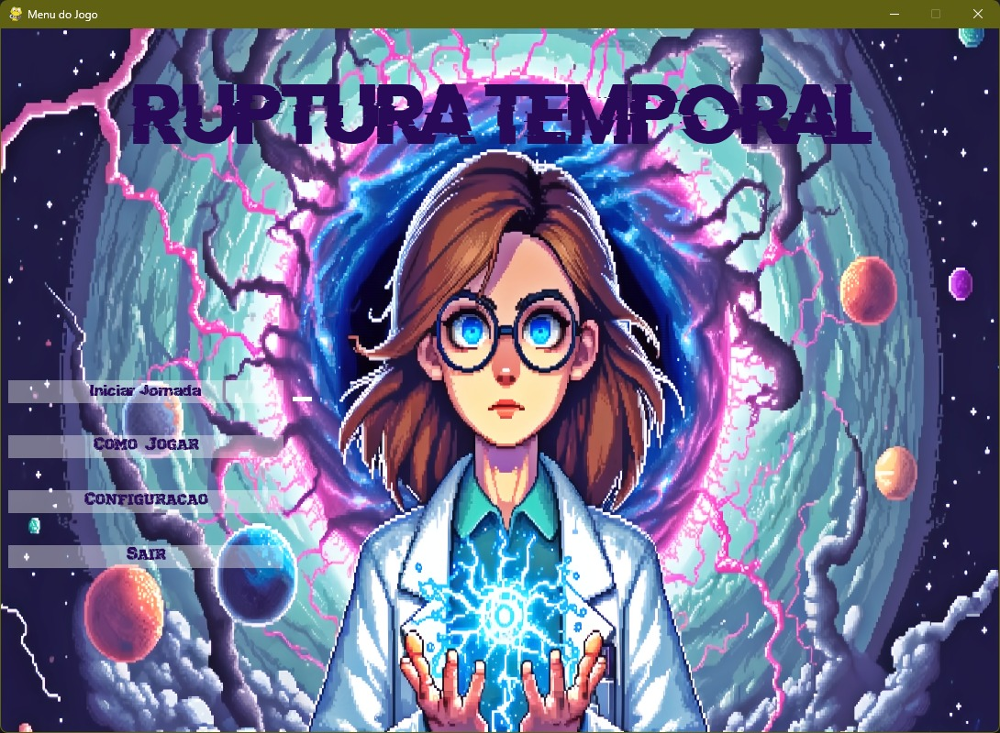

<br/><br/>

### 🌊 Fase 1 — A Praia em Ruínas
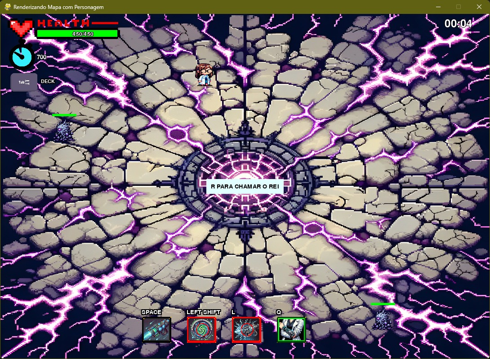

<br/><br/>

### ❄️ Fase 2 — O Reino Gélido
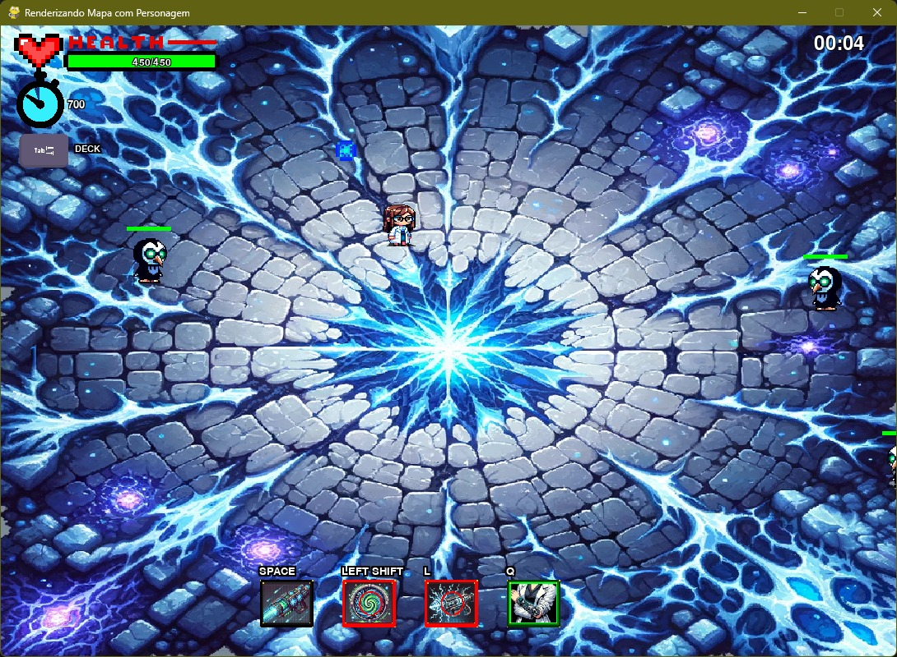

<br/><br/>

### 🐀 Fase 3 — A Dimensão dos Ratos Cultistas
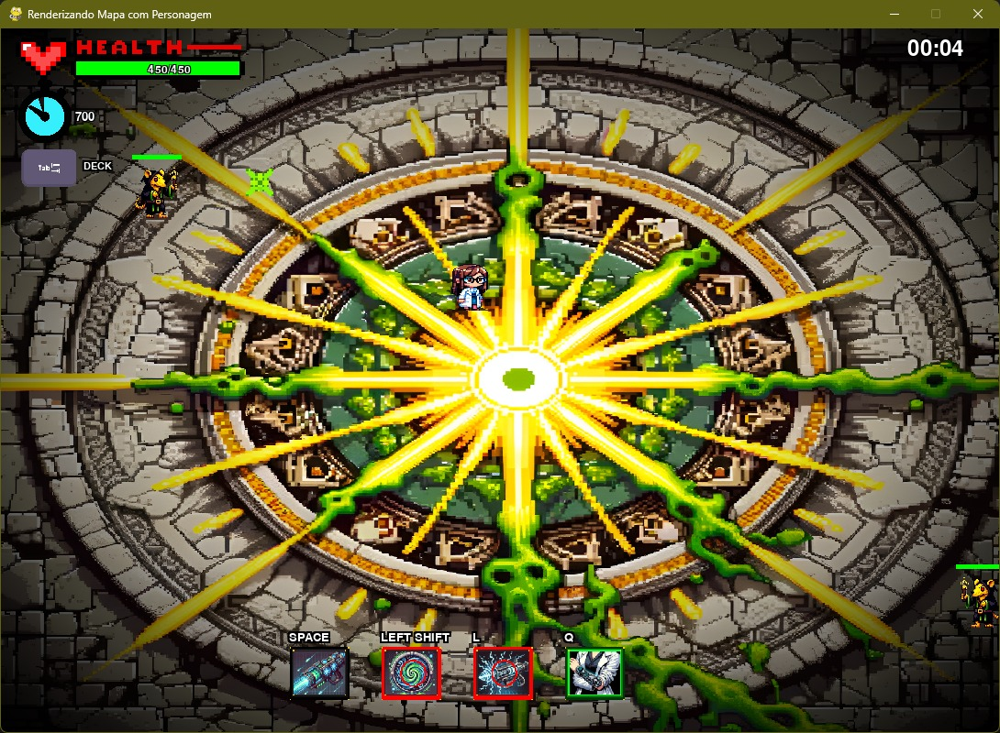

<br/><br/>

### 🐸 Fase 4 — O Mundo dos Sapos Cientistas
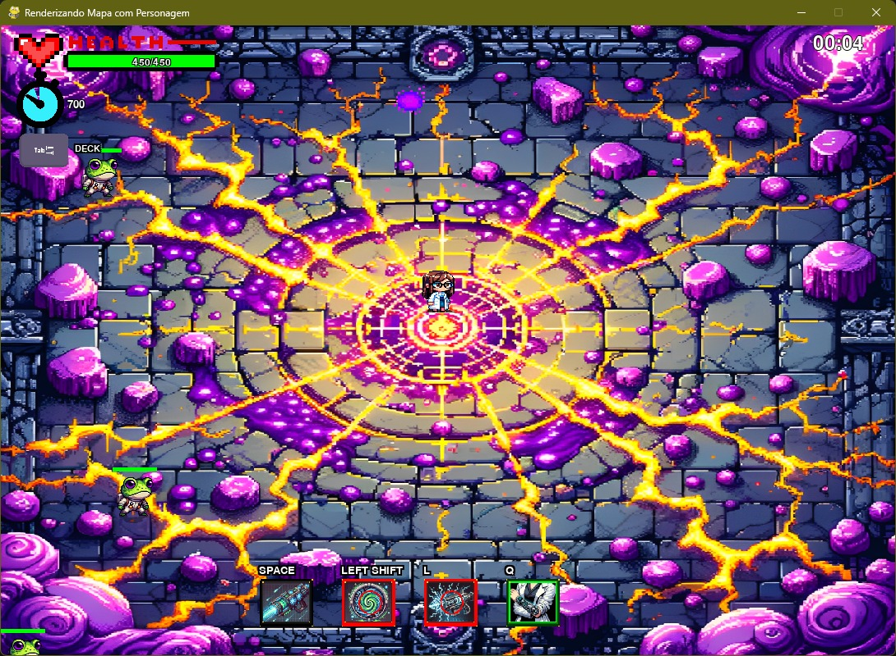

<br/><br/>

### 🔥 Fase 5 — Em Desenvolvimento
> A quinta e última fase está em desenvolvimento. Esta será a fase final, onde o jogador enfrentará o boss derradeiro.

</div>

---

## ✨ Funcionalidades

### 🎯 Gameplay
- **5 fases temáticas** — cada uma com ambiente, inimigos e boss únicos
- **Sistema de combate** com ataques corpo-a-corpo e projéteis
- **Dash/Teleporte** para esquivar de ataques inimigos
- **Loja de Cartas (Deck)** — sistema de upgrades com rolagem aleatória e compra de melhorias
- **Sistema de pontuação** — elimine inimigos para ganhar pontos e melhorar o personagem
- **Bosses épicos** com padrões de ataque variados e fases de comportamento
- **Boss com IA evolutiva (Q-Learning)** — o boss Umbra aprende e se adapta ao estilo do jogador a cada partida

### 🧙 Sistema de Áureas (Passivas)
- **4 Áureas distintas** — Racional, Impulsiva, Vanguarda e Devota
- Cada Áurea altera o estilo de jogo com bônus automáticos
- Sistema de evolução/upgrade de Áureas com persistência entre partidas

### 🌐 Multiplayer LAN (Cooperativo)
- **Host & Join** — crie ou conecte-se a uma sessão diretamente pelo menu
- **Descoberta automática via UDP Broadcast** na rede local
- **Sincronização em tempo real** de posições, ações, inimigos e estado do jogo
- **Sistema de ping** para monitoramento de latência
- **Revive cooperativo** — jogadores podem morrer e reviver após um cooldown

### 🛠️ Extras
- **Tutorial integrado** — ensinando os controles passo a passo
- **Suporte a Gamepad/Joystick** — jogue com controle Xbox ou similar
- **Configuração de teclas** — personalize os controles do teclado
- **Sistema de save** — salve e carregue atributos do personagem
- **Efeitos sonoros e música** — trilha sonora temática por fase
- **Tela de Game Over** com opções de retry

---

## 🔮 Áureas — Passivas dos Personagens

Cada jogador pode escolher uma **Áurea** antes de iniciar uma partida. As Áureas definem a passiva (habilidade automática) do personagem, influenciando diretamente o estilo de jogo.

<div align="center">
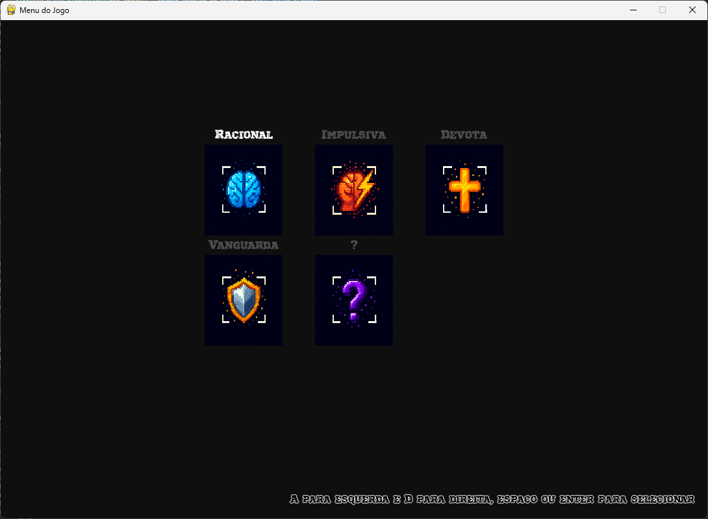
</div>

<br/>

<table align="center">
<tr>
<td align="center" width="50%">

### 🧠 Áurea Racional

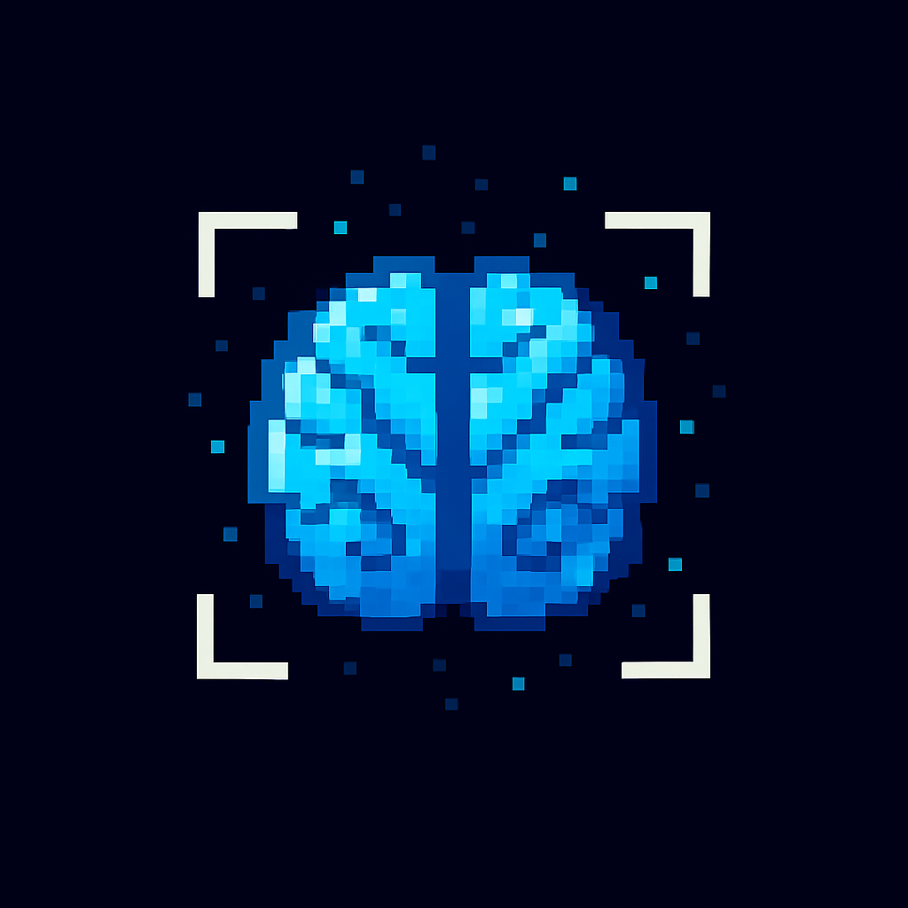

*"A paciência é a arma mais poderosa."*

Ideal para jogadores **estratégicos e pacientes**.
- Aumenta a pontuação quando o jogador permanece imóvel por alguns segundos
- Após 5 segundos parado, ganha +3 pontos (escala com nível)
- Efeito visual verde indica o ganho

</td>
<td align="center" width="50%">

### 🔥 Áurea Impulsiva

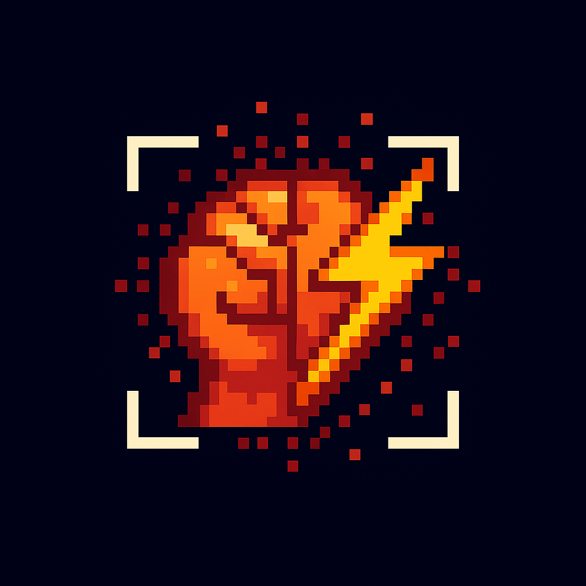

*"A fúria é o combustível da vitória."*

Para jogadores com estilo **agressivo e dinâmico**.
- Buff temporário após 5 eliminações seguidas sem levar dano
- Bônus aleatório: aumento de dano ou velocidade
- Sofrer dano reinicia o contador

</td>
</tr>
<tr>
<td align="center" width="50%">

### ⚔️ Áurea Vanguarda

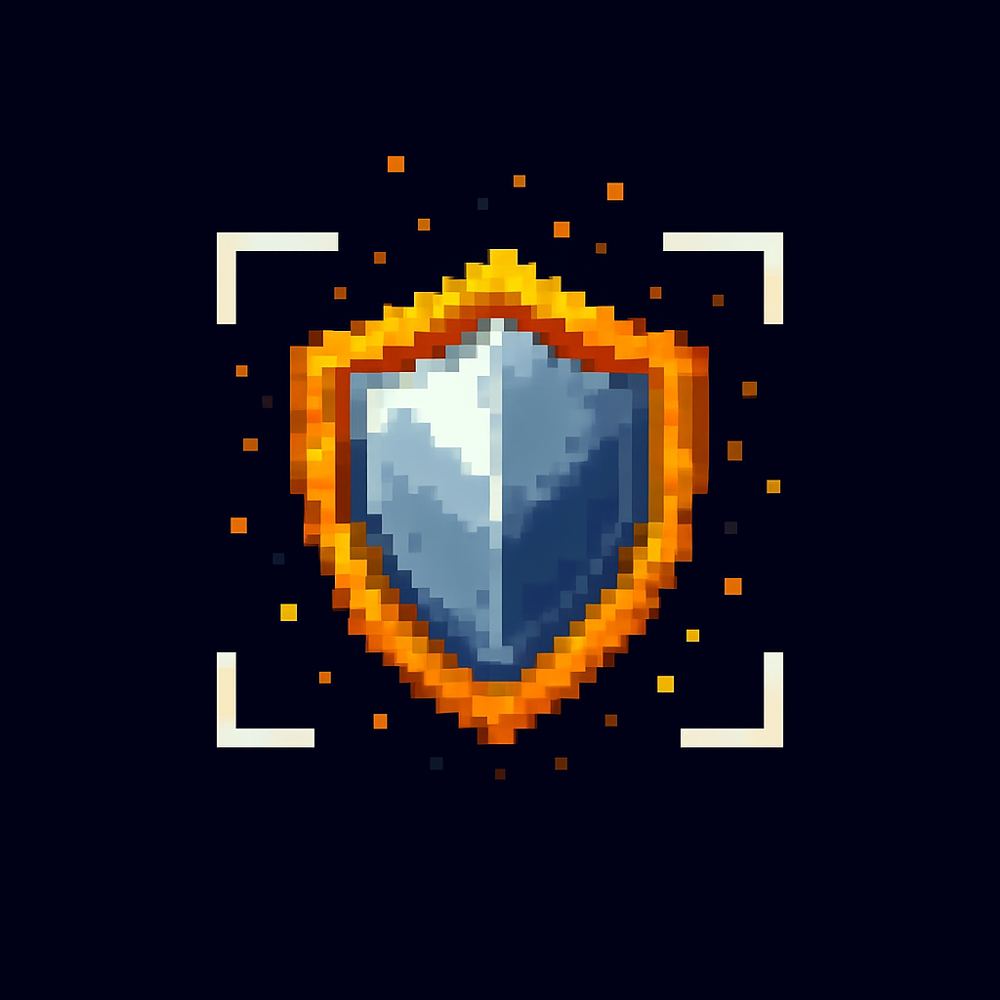

*"A dor também é uma arma."*

Para quem joga na **linha de frente**.
- Ao sofrer dano direto, incendeia inimigos próximos
- Cria zona perigosa para inimigos corpo a corpo
- Ideal para confrontos diretos

</td>
<td align="center" width="50%">

### 🛡️ Áurea Devota

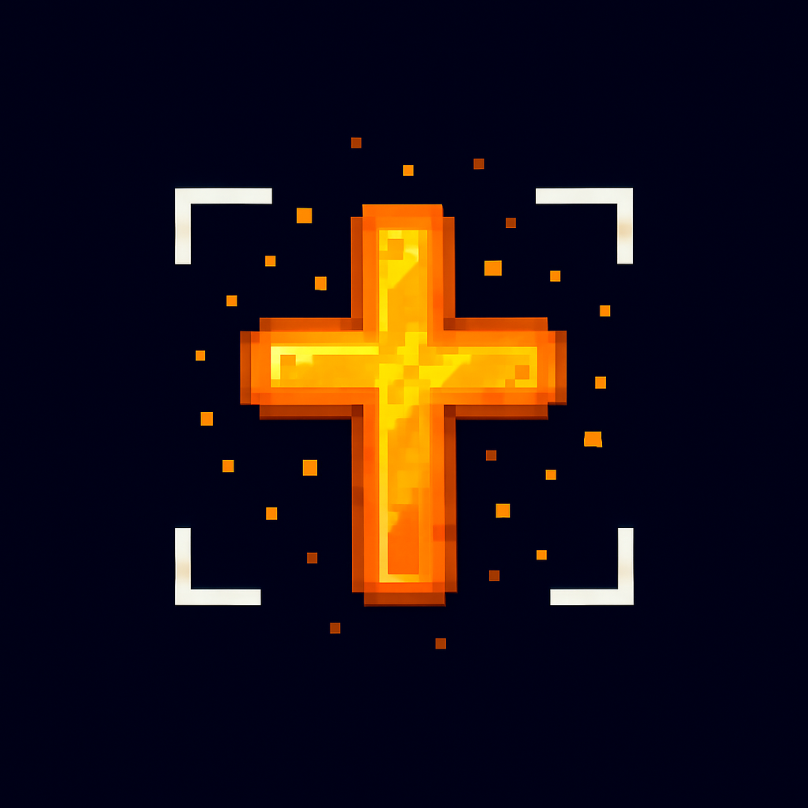

*"Fé é escudo."*

Para jogadores que valorizam **resistência e defesa**.
- Escudo temporário que absorve o próximo golpe
- Regeneração automática após intervalo fixo
- Resiste a ataques consecutivos sem perder vida

</td>
</tr>
</table>

---

## 🌐 Arquitetura de Rede (LAN)

A versão Beta introduz uma camada de rede baseada em **sockets TCP** e **serialização JSON**, permitindo comunicação direta entre duas instâncias do jogo.

A arquitetura segue o modelo **cliente-servidor**, onde o Host mantém o estado do jogo e envia atualizações para o cliente em tempo real.

```
┌──────────────┐         TCP/5050          ┌──────────────┐
│   HOST       │◄────────────────────────►│   CLIENT     │
│              │   JSON serialization      │              │
│  Thread TX ──┼──────────────────────────►│── Thread RX  │
│  Thread RX ──┼◄──────────────────────────│── Thread TX  │
│              │                           │              │
│  Game Loop   │   UDP Broadcast (LAN)     │  Game Loop   │
│  State Sync  │◄─ ─ ─ ─ ─ ─ ─ ─ ─ ─ ─ ─ │  Discovery   │
└──────────────┘                           └──────────────┘
```

**Principais características:**
- 🔄 Sincronização de posições, ações e inimigos em tempo real
- 📡 Descoberta automática de host via **UDP Broadcast**
- 🧵 **Threads independentes** para envio e recebimento (não bloqueia o game loop)
- 📊 Monitoramento de latência (ping) em tempo real
- 🔐 Integridade de pacotes com delimitadores JSON
- 🎮 Escolha de modo (Host / Join / Offline) integrada ao menu principal

<div align="center">
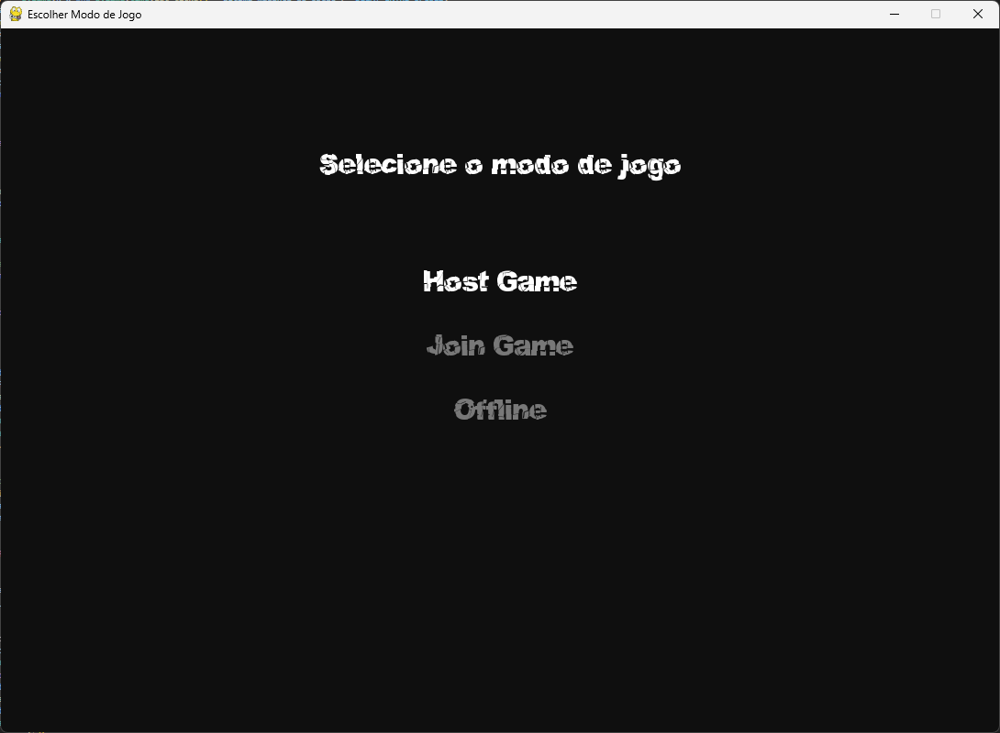

> Crie uma sessão (Host Game) ou conecte-se a uma partida existente (Join Game) diretamente pelo menu.
</div>

---

## 🛠️ Tecnologias Utilizadas

| Tecnologia | Uso |
|:---:|:---|
|  | Linguagem principal do projeto |
|  | Framework para renderização 2D, áudio, input e game loop |
|  | Comunicação em rede para o modo LAN cooperativo |
|  | Serialização de dados, configurações, saves e pacotes de rede |
|  | Threads para envio/recebimento de dados sem bloquear o jogo |
|  | Validação de integridade dos saves (anti-cheat) |
|  | Detecção de resolução de tela |
|  | Sprites e cenários gerados por IA e tratados manualmente |
|  | IA evolutiva do boss Umbra (aprendizado por reforço) |

---

## 📁 Estrutura do Projeto

```
Ruptura_Temporal/
├── Ruptura_Temporal.py    # 🚀 Ponto de entrada — Menu principal do jogo
├── GAME.py                # 🎮 Fase 1 — A Praia em Ruínas (modo offline)
├── GAME2.py               # ❄️ Fase 2 — O Reino Gélido
├── GAME3.py               # 🐀 Fase 3 — A Dimensão dos Ratos Cultistas
├── GAME4.py               # 🐸 Fase 4 — O Mundo dos Sapos Cientistas
├── GAME5.py               # 🔥 Fase 5 — Em desenvolvimento
├── GAMERE.py              # 🌐 Modo LAN — Jogo cooperativo em rede
├── rede.py                # 📡 Módulo de rede (sockets TCP/UDP, threads)
├── Variaveis.py           # ⚙️ Variáveis globais, configuração de tela e bosses
├── utils.py               # 🔧 Utilitários (hash, save/load de Áureas)
├── habilidade_boss.py     # 🧠 IA do boss Umbra (Q-Learning evolutivo)
├── Deck.py                # 🃏 Sistema de cartas (sprites de upgrades)
├── Tela_Cartas.py         # 🛒 Loja de cartas (modo offline)
├── Tela_Cartas_Coop.py    # 🛒 Loja de cartas (modo cooperativo)
├── Tutorial.py            # 📚 Fase tutorial com instruções interativas
├── Digitacao.py           # ⌨️ Efeito de digitação para narrativa
├── Config_Teclas.py       # ⌨️ Configuração personalizável de controles
├── Game_Over.py           # 💀 Tela de Game Over
├── test.py                # 🧪 Testes
├── config_teclas.json     # Configuração de teclas salva
├── modo_jogo.json         # Modo de jogo selecionado (host/join/offline)
├── aurea_selecionada.json # Áurea escolhida pelo jogador
├── memoria_umbra.json     # Memória evolutiva da IA do boss
├── tutorial_config.json   # Configuração do tutorial
├── tipo_conexao.json      # Tipo de conexão de rede
├── LICENSE.txt            # Licença CC BY-NC-SA 4.0
├── Sounds/                # 🔊 Efeitos sonoros e músicas
├── Sprites/               # 🎨 Sprites, cenários e assets visuais
│   ├── Git/               # Screenshots para o README
│   └── Deck/              # Sprites das cartas de upgrade
└── Texto/                 # 🔤 Fontes customizadas (.otf, .ttf)
```

---

## 🚀 Instalação e Execução

### 📦 Para jogadores (sem necessidade de Python)

Baixe o executável pronto para jogar:

> **[📥 Download — Ruptura Temporal v0.0.1](https://github.com/HenryMelo23/Ruptura_Temporal/releases/tag/v0.0.1)**

### 🐍 Para desenvolvedores

**Pré-requisitos:**
- Python 3.x instalado
- pip (gerenciador de pacotes)

```bash
# 1. Clone o repositório
git clone https://github.com/HenryMelo23/Ruptura_Temporal.git
cd Ruptura_Temporal

# 2. Instale as dependências
pip install pygame pyperclip requests

# 3. Execute o jogo
python Ruptura_Temporal.py
```

---

## 🎹 Controles

### ⌨️ Teclado + Mouse

| Ação | Tecla |
|:---|:---:|
| Mover | `W` `A` `S` `D` |
| Atacar | `Botão Esquerdo do Mouse` |
| Dash / Teleporte | `SHIFT` |
| Abrir Loja de Cartas | `Q` |
| Comprar na Loja | `E` |
| Chamar o Rei (Boss) | `R` |
| Pausar / Voltar | `ESC` |

### 🎮 Controle (Gamepad)

| Ação | Botão |
|:---|:---:|
| Mover | `Analógico Esquerdo` |
| Atacar | `X` |
| Teleporte | `A` |
| Abrir Loja | `Y` |
| Voltar | `RB` |

> Os controles do teclado podem ser personalizados no menu de **Configuração**.

---

## 🗺️ Roadmap

- [x] Fase 1 — A Praia em Ruínas
- [x] Fase 2 — O Reino Gélido
- [x] Fase 3 — A Dimensão dos Ratos Cultistas
- [x] Fase 4 — O Mundo dos Sapos Cientistas
- [x] Sistema de Áureas (4 passivas)
- [x] Loja de Cartas / Upgrades
- [x] Modo LAN Cooperativo (Host & Join)
- [x] Descoberta automática via UDP
- [x] Tutorial interativo
- [x] Suporte a Gamepad
- [x] IA evolutiva do boss (Q-Learning)
- [ ] Fase 5 — Boss final
- [ ] Balanceamento de dificuldade (Fase 2)
- [ ] Melhorias na estabilidade da rede
- [ ] Mais Áureas e cartas

---

## 🤝 Como Contribuir

Contribuições são o que tornam a comunidade open-source um lugar incrível para aprender e criar. Qualquer contribuição é **muito bem-vinda**!

1. Faça um **Fork** do projeto
2. Crie sua **Feature Branch** (`git checkout -b feature/MinhaFeature`)
3. Faça o **Commit** das mudanças (`git commit -m 'Adiciona MinhaFeature'`)
4. Faça o **Push** para a branch (`git push origin feature/MinhaFeature`)
5. Abra um **Pull Request**

### 💡 Ideias de contribuição
- 🐛 Reportar bugs e problemas
- 🎨 Criar novos sprites ou melhorar os existentes
- ⚖️ Sugerir ajustes de balanceamento
- 🌐 Testar o modo LAN em diferentes redes e máquinas
- 📡 Reportar comportamentos de latência ou desconexão
- 📝 Melhorar a documentação

---

## 📜 Licença

Distribuído sob a licença **Creative Commons Attribution-NonCommercial-ShareAlike 4.0 International**.

| Permissão | Status |
|:---|:---:|
| Uso pessoal e educacional | ✅ Permitido |
| Modificação e redistribuição | ✅ Com atribuição e mesma licença |
| Uso comercial | ❌ Proibido sem autorização |

Veja [LICENSE.txt](LICENSE.txt) para mais informações.

---

## 💜 Agradecimentos

Gostaria de agradecer a todos que acompanharam e apoiaram o desenvolvimento desse projeto. A ideia inicial era algo pessoal, mas graças ao apoio da comunidade, o projeto cresceu e se tornou algo maior.

Agradeço também à **Universidade de Brasília (UnB)** e à disciplina de **Redes de Computadores**, que possibilitaram a expansão do projeto para um ambiente multiplayer e a consolidação desta versão Beta.

Espero que este projeto ajude a inspirar e ensinar aqueles que querem aprender a criar jogos e explorar o desenvolvimento em Python com Pygame.

---

## 📬 Contato

<div align="center">

[](https://www.instagram.com/henri_meelo/)
[](https://www.youtube.com/@HMeloI)
[](https://github.com/HenryMelo23)

</div>

---

<div align="center">

**Seja você um desenvolvedor iniciante ou experiente, "Ruptura Temporal" é um projeto feito para todos.**
**Aproveite, aprenda e contribua. Vamos crescer e evoluir juntos!** 🚀

`Versão Atual: Ruptura Temporal – Beta (Offline + LAN)`

</div>


